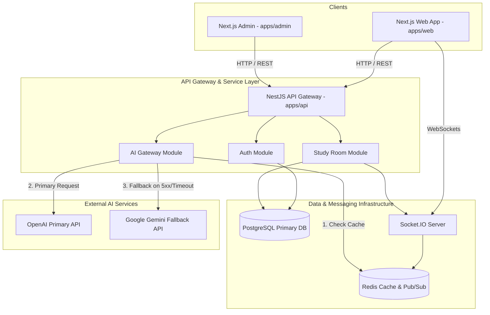
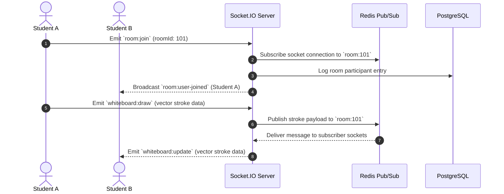
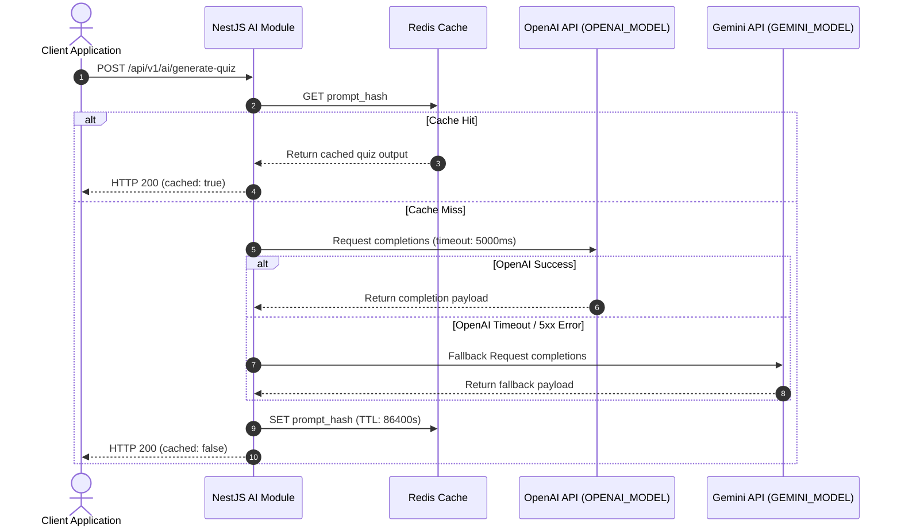

# Architecture Blueprint & System Design

## 1. System Architecture Diagram



---

## 2. Realtime WebSockets Collaboration Sequence



---

## 3. Dual-Model AI Fallback Gateway Sequence



---

## 4. Package Import Rules & Boundaries

```
apps/web ----> packages/ui
apps/web ----> packages/types
apps/web ----> packages/utils
apps/admin --> packages/ui
apps/admin --> packages/types
apps/admin --> packages/utils
apps/api ----> packages/types
apps/api ----> packages/utils
packages/ui --> packages/config
```
- **Constraint**: `apps/*` modules are completely isolated and cannot import from sibling apps.
- **Constraint**: Shared state & schema DTOs are defined strictly in `packages/types`.
