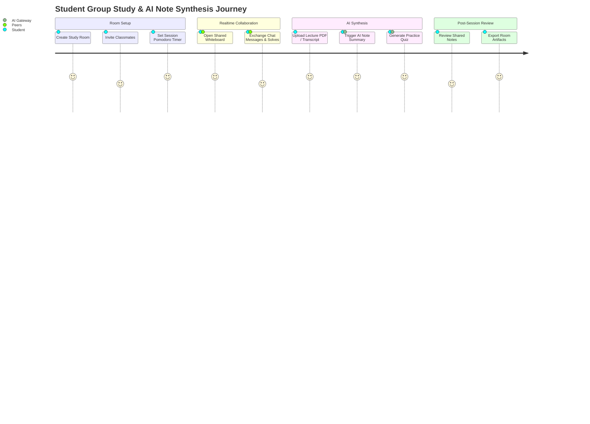

# Product Discovery & Specification

## 1. Executive Vision

The **AI-Powered Group Study Hub** transforms traditional self-study and peer group study into an intelligent, adaptive, and highly interactive learning experience. By combining real-time canvas/chat collaboration with a resilient dual-model AI Engine (OpenAI + Gemini), students can generate study notes, synthesize quizzes from uploaded material, and receive real-time AI tutoring within shared study rooms.

---

## 2. Target User Personas

### Persona A: Competitive Exam Aspirant (e.g., JEE, NEET, SAT, GRE)
- **Pain Point**: Needs rapid problem-solving feedback, flashcard generation, and high-intensity peer accountability.
- **Goal**: Create structured daily study rooms, convert dense PDFs into flashcards, and track quiz accuracy metrics.

### Persona B: College Undergraduate Student
- **Pain Point**: Coordination across group projects, exam cram sessions, and fragmented study notes.
- **Goal**: Real-time collaborative whiteboard for solving assignments, auto-generating summary notes from lecture transcripts.

### Persona C: High School Student
- **Pain Point**: Struggles with concept retention and engaging study methods.
- **Goal**: Gamified study rooms with pomodoro timers, AI concept explainers ("explain like I'm 15"), and interactive practice quizzes.

---

## 3. User Journey Maps

### Journey 1: Collaborative Study Session & AI Synthesis

---

## 4. Key Feature Modules

### Module 1: Real-time Study Rooms
- Multi-user WebSockets connection via Socket.IO.
- Shared vector whiteboard for diagram drawing and math formula editing.
- Built-in Pomodoro clock synchronized across participants.
- Text chat with markdown support and code syntax highlighting.

### Module 2: AI Gateway & Smart Assistant
- **Dual-Model Resilience**: Primary requests routed to OpenAI (`OPENAI_MODEL`); automatic fallback to Google Gemini (`GEMINI_MODEL`) on errors or timeouts.
- **Smart Summarizer**: Extracts key takeaways, bulleted summaries, and key formula lists from markdown or uploaded text.
- **Quiz Generator**: Produces multiple-choice questions (MCQs) with difficulty options and explanations.
- **Semantic Redis Caching**: Hashes prompt inputs to return instant cached responses for duplicate study queries.

### Module 3: Analytics & Progress Dashboard
- Individual study streak tracking.
- Quiz performance metrics by topic area.
- Time spent in active study rooms.
